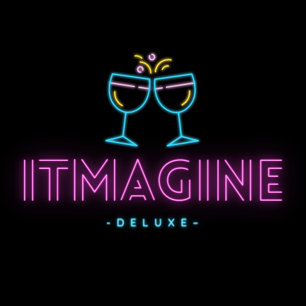
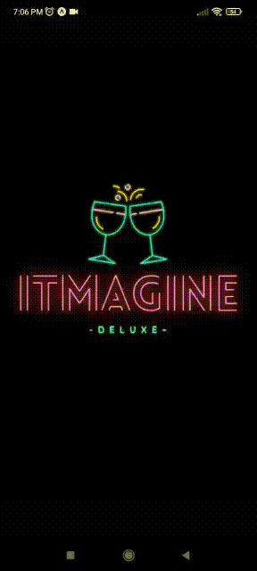
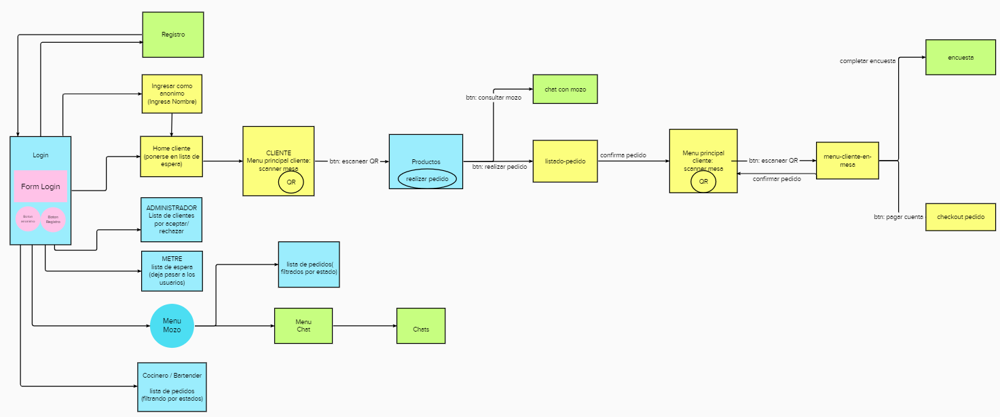
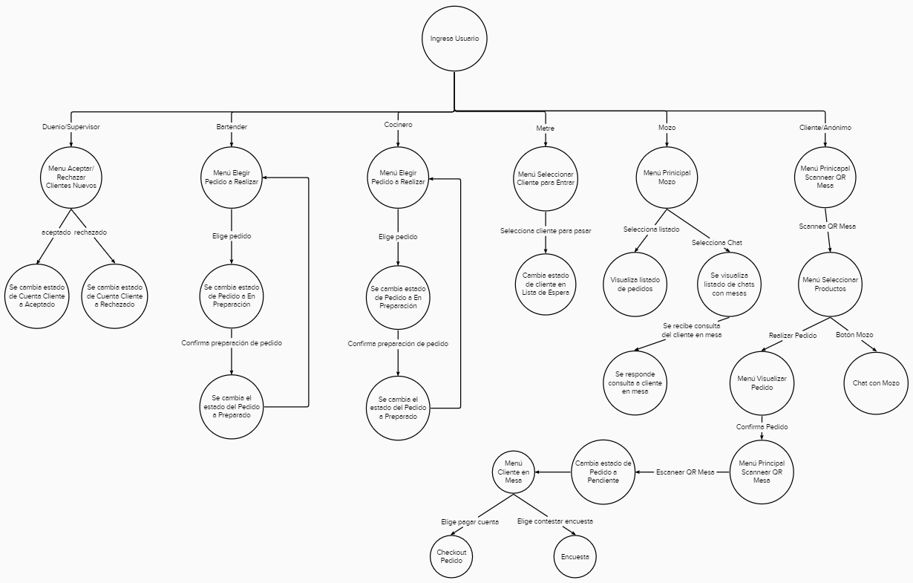

# TP PPS: ITMAGINE-App
Integrantes:
- Alberto Giffard
- Agustin Clas
- Leandro Varela

Se realizará una aplicación donde abarcaremos toda la comunicación de un restaurante que lleva por nombre "ITMAGINE"
a partir de ahora se llamará como "comanda".
Hasta el momento las tareas de los integrantes se dividirán de la siguiente manera:
**Alberto Giffard**
* Imagenes / redimensiones / iconos
* Splash Screen
* Menu de login
* Menu Gestion (opciones por tipo de usuario*)
* Clase Padre Usuarios
* Alta productos
* Crear Servicio de Firebase #1 ( productos )
* Cargar clientes (3)
* Cargar mesas (2)
* Cargar dueño (2)
* Cargar supervisor (3)
* Cargar empleado (3 y 2) - cocinero y bartender
* Cargar productos (4) - bebidas
* QR propina
* Crear Servicio de Firebase #2 ( QR  Propina)
* Encuestas supervisor
* Crear Servicio de Firebase #3 ( encuesta supervisor (se asocia al supervisor) )
* Crear encuesta empleados y supervisor (1 y 3)
* Gestion realiza pedidos (platos y bebidas)
* Clase PN
* PN consultar al mozo
* PN confirmar pedido (por parte del mozo)
* Delivery con GPS pt. 2
* juego 3

**Agustin Clas**
* Crear un repositorio para el proyecto (dar permisos y demas) 
* Menu principal (top, bottom bar)
* Crear usuarios de prueba (login (distintos niveles))
* Menu QR (opciones por tipo de usuario*)
* Clase sonidos
* Alta dueño / supervisor
* Crear Servicio de Firebase #1 ( dueño / supervisor (usar collection duenio-supervisor))
* Alta empleado
* Crear Servicio de Firebase #1 ( empleado )
* Cargar clientes (3)
* Cargar mesas (2)
* Cargar empleado (3) - mozo
* Cargar productos (3) - cocina
* QR de la mesa
* Crear Servicio de Firebase #2 ( QR  mesa )
* Encuesta empleados
* Crear Servicio de Firebase #3 ( encuesta empleados (se asocia al empleado ) )
* Crear encuesta empleados (4)
* Gestion de nuevo cliente registrado
* Gestion de confirmar pedidos
* PN se agrega cliente nuevo
* PN confirmar realizacion del pedido (por parte del cocinero o bartender)
* Delivery con GPS pt. 1
* juego 2

**Leandro Varela**
* Vincular cuenta en firebase
* Crear Proyecto
* Crear app en Firebase / actualizar proyecto
* Crear collection duenio-supervisor
* Menu Altas (opciones por tipo de usuario*)
* Menu Delivery (opciones por tipo de usuario*)
* Datos que se pasan entre pantallas del usuario
* Alta cliente
* Crear Servicio de Firebase #1 ( cliente )
* Alta mesa
* Crear Servicio de Firebase #1 ( mesa )
* Cargar clientes (3)
* Cargar mesas (2)
* Cargar empleado (3) - metre
* Cargar productos (3) - cocina
* QR ingreso al local
* Crear Servicio de Firebase #2 ( QR  ingreso local )
* Encuesta clientes
* Crear Servicio de Firebase #3 ( encuesta clientes (se asocia al cliente) )
* Crear encuesta clientes (4)
* Gestion de ingreso al local
* Gestion de generar reservas agendadas
* PN ingreso al local
* PN generar reservas agendadas / delivery
* Delivery mapa de ruta hasta el domicilio de entrega
* Juego 1

## Semana 1
Hemos llevado a cabo la primera reunión de equipo donde definimos puntos, tareas y tiempos de cada uno de los integrantes, quedando desglosado en los siguientes puntos:
**Leandro Varela**
* Creación del proyecto
* Subida a Firebase del proyecto
* Creación de clases primarias a utilizar a lo largo del proyecto

**Agustin Clas** 
* Maquetado y diseño del login
* Desarrollo de login
* Interacción con Firebase
* Se prioriza proyecto de la materia de Labo IV y luego continuar con este

**Alberto Giffard**
* Creación del repositorio y actualización del Readme
* Diseño de logos y tamaños
* Creación de mail coorporativo
* Creación de Splash Screen
* Se prioriza proyecto de la materia de Labo IV y luego continuar con este

## Semana 2
Nuestro compañero Leandro fue el que más avanzó ya que como se determinó la primera semana, Agustin y yo venimos avanzando con Laboratorio IV para luego adentrarnos de lleno con este proyecto. Queda para la próxima entrega la entrega de los distintos diagramas, esta semana fue complicado reunirnos para poder llevarlo a cabo, asi que será para la próxima fecha
**Leandro Varela**
* Se crearon las interfaces
* Creación de clases principales
* Creación de Servicio de Firebase

**Agustin Clas** 
* Diseño y maquetado del login principal
* Desarrollo del login
* logica de login
* comienzo de maquetado de menu principal

**Alberto Giffard**
* Diseño y creacion de logo
* Diseño y desarrollo de Splashscreen

## Semana 3
Se avanzó bastante de forma global en la app, desde el circuito de pantallas que se explicará en las siguientes imagenes, asi como la distribución de los distintos contenidos. Aun no encontramos necesidad de realizar alguna demostración grupal por lo que no fue necesario para esta instancia, en la siguiente probablemente lo sea dependiendo de los avances que tengamos
**Leandro Varela**
* Definición de Clases
* Definir Context de la Aplicación
* Crear Pantalla Loading

**Agustin Clas**
* Crear Menú Principal Administrador: Listado de Clientes por Aceptar/Rechazar
* Menú de Login

**Alberto Giffard**
* Crear correo electrónico de empresa
* Crear pantalla ingresar como anónimo
* Lectura de código QR

